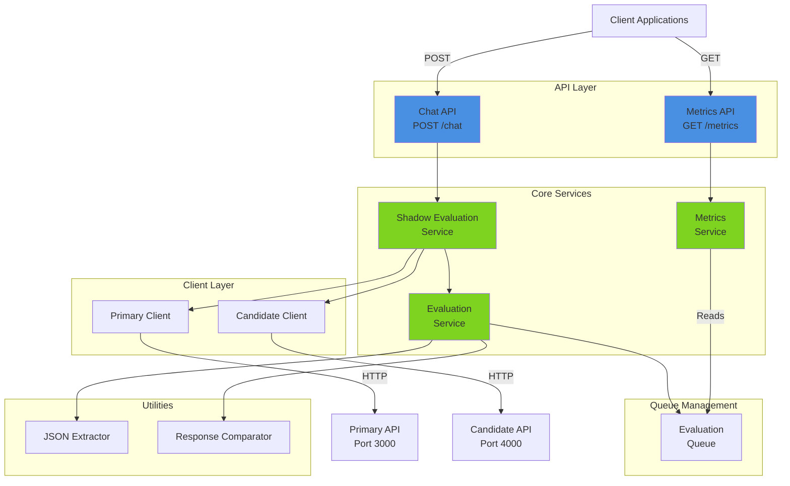
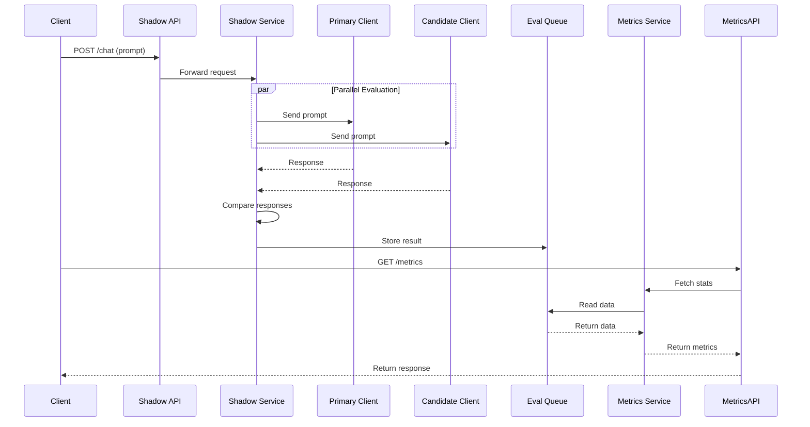
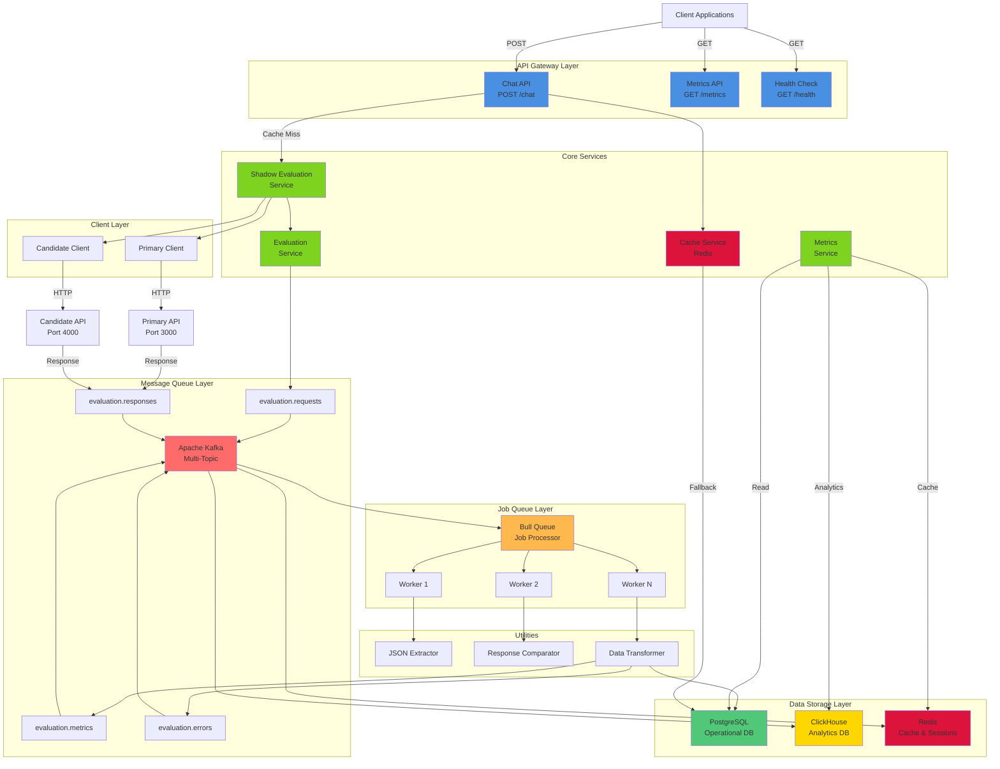
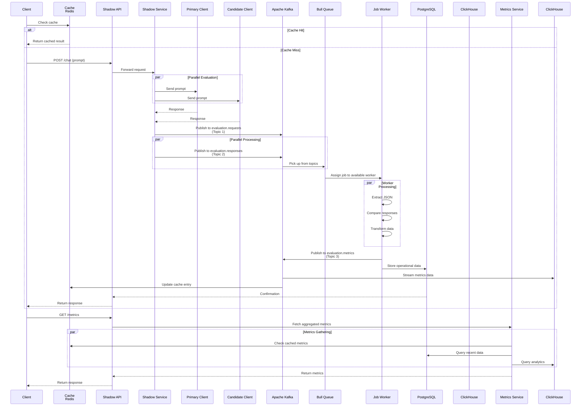
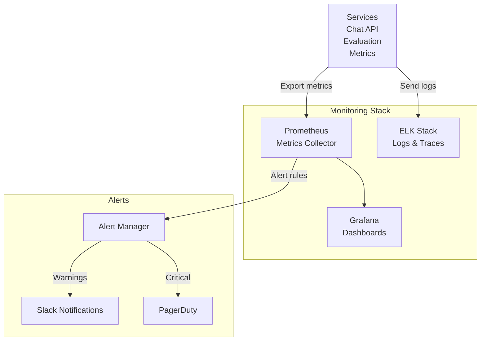

# ShadowEval Architecture

## Current Architecture

### Present State Diagram



### Current Data Flow



---

## Future Architecture

### Scalable State with Data Pipeline



### Future Data Flow with Kafka & Bull



---

## Component Details

### Kafka Topics Architecture

| Topic | Purpose | Consumers | Data |
|-------|---------|-----------|------|
| `evaluation.requests` | Incoming evaluation requests | Bull Queue, Logger | Prompt, request ID, timestamp |
| `evaluation.responses` | Response data from both clients | Bull Queue, Transformer | Primary response, Candidate response, timestamps |
| `evaluation.metrics` | Computed metrics and comparisons | ClickHouse, Cache, Metrics Service | Similarity, latency, differences |
| `evaluation.errors` | Error tracking and logging | ClickHouse, Alert System | Error type, stack trace, context |

### Database Schema Overview

**PostgreSQL (Operational)**
```
- evaluation_requests (id, prompt, created_at)
- evaluation_responses (id, request_id, source, response, timestamp)
- evaluation_results (id, request_id, similarity, latency, status)
- user_sessions (id, user_id, created_at, last_activity)
```

**ClickHouse (Analytics)**
```
- evaluation_metrics (request_id, timestamp, similarity, latency, error_count)
- performance_analytics (timestamp, source, avg_latency, throughput)
- anomaly_detection (timestamp, metric_type, value, is_anomaly)
```

**Redis (Cache)**
```
- evaluation:{request_id} → cached result (TTL: 1 hour)
- metrics:{period} → aggregated metrics (TTL: 5 minutes)
- sessions:{session_id} → session data (TTL: 24 hours)
```

### Bull Job Processing

**Job Types:**
1. `ProcessEvaluation` - Extract and compare responses
2. `AggregateMetrics` - Compute analytics
3. `TransformData` - Normalize and enrich data
4. `PublishMetrics` - Push to ClickHouse

**Concurrency:** Multiple workers processing jobs in parallel

---

## Migration Path

### Phase 1: Add Kafka
- Introduce Kafka topics for event streaming
- Implement producers in shadow service
- Begin event-driven architecture

### Phase 2: Add Bull Queue
- Integrate Bull with Kafka consumers
- Move async processing to job workers
- Implement job retries and error handling

### Phase 3: Add PostgreSQL
- Migrate from in-memory storage
- Implement transactional consistency
- Set up backup and replication

### Phase 4: Add ClickHouse
- Stream metrics from Kafka to ClickHouse
- Build analytics dashboards
- Implement time-series queries

### Phase 5: Add Redis
- Implement caching layer
- Add session management
- Optimize frequently accessed data

---

## Scaling Considerations

### Horizontal Scaling
- **Kafka**: Add broker nodes for increased throughput
- **Bull**: Add worker processes/nodes
- **PostgreSQL**: Read replicas for query scaling
- **ClickHouse**: Distributed cluster setup
- **Redis**: Redis Cluster for high availability

### Vertical Scaling
- Increase resources (CPU, RAM) for each component
- Optimize database indexes
- Tune JVM/Node.js heap sizes

### Load Balancing
```
Client → Load Balancer → Multiple API instances
           ↓
        API Gateway (handles /chat, /metrics, /health)
           ↓
        Service mesh (Kafka, Bull, Cache lookup)
```

---

## Monitoring & Observability



---

## Future Enhancements

- **Machine Learning**: Anomaly detection on metrics
- **Real-time Dashboards**: WebSocket-based live metrics
- **Auto-scaling**: Kubernetes-based orchestration
- **Multi-region**: Geographic distribution for latency optimization
- **Data Warehouse**: Advanced analytics and reporting
